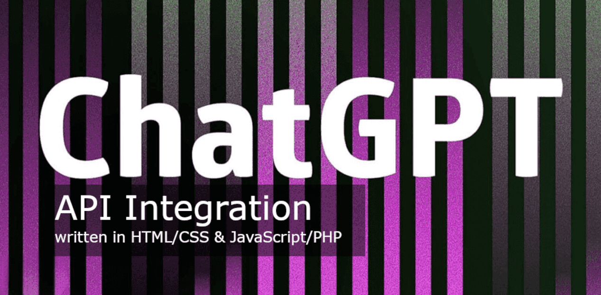
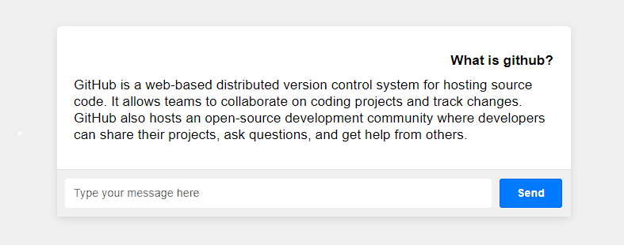

# GPT API Integration (in HTML/CSS with JS/PHP)
###### Updated: 13.07.2023 (Working well) Please note that this code example is for a basic web application. 

### Other Important sources for you! Please read befor!
- [Secure Implementation of Artificial Intelligence (AI)](https://github.com/VolkanSah/Implementing-AI-Systems-Whitepaper)
- [GPT Security Best Practices (with GPT3.5-Turbo Example)](https://github.com/VolkanSah/GPT-Security-Best-Practices)
###### GPT is interesting, let's use it to create a better world.

This README.md file will guide you through the process of integrating the GPT API into your PHP-based website, enabling chat functionality using OpenAI's API.

## Prerequisites
-  PHP 7.4 or higher installed on your web server
-  A web server with support for PHP (e.g., Apache or Nginx)
-  Knowledge of HTML, CSS, and JavaScript (for designing the chat interface)
-  An API key for the GPT API from Openai.com

## API Key
- Register for an account or log in to the OpenAi platform.
- Navigate to the API Keys section and generate a new API key.
- Store the API key safely, as you will need it in the next step.

## Setting Up
- Clone or download this repository.
- Replace YOUR_API_KEY and MODEL in config.php.
- Replace the API_ENDPOINT URL in gptchat.php according to your needs (see list below).
- Upload index.html, style.css, script.js, and gptchat.php files to your web server.
- Access index.html in your browser (e.g., https://yourdomain.com/index.html).
- Type a message in the chat input field and press Enter or click the Send button to send the message.
- The OpenAI API should respond with a message from the language model.
- Be cautious and set limits on your OpenAI Dashboard.
## OpenAi-API Endpoints
**please change gptchat.php & config.php to your needs**

ENDPOINT | MODEL NAME
-- | --
/v1/chat/completions | gpt-4, gpt-4-0314,gpt-4-0613, gpt-4-32k, gpt-4-32k-0314, gpt-3.5-turbo, gpt-3.5-turbo-0301, gpt-3.5-turbo-0613, gpt-3.5-turbo-16k, gpt-3.5-turbo-16k-0613.
/v1/completions | ada, ada-code-search-code, ada-code-search-text, ada-search-document, ada-search-query, ada-similarity, babbage, babbage-code-search-code, babbage-code-search-text, babbage-search-document, babbage-search-query, babbage-similarity, code-davinci-edit-001, code-search-ada-code-001, code-search-ada-text-001, code-search-babbage-code-001, code-search-babbage-text-001, curie, curie-instruct-beta, curie-search-document, curie-search-query, curie-similarity, davinci, davinci-instruct-beta, davinci-search-document, davinci-search-query, davinci-similarity, text-ada-001, text-babbage-001, text-curie-001, text-davinci-001, text-davinci-002, text-davinci-003, text-davinci-edit-001, text-embedding-ada-002, text-search-ada-doc-001, text-search-ada-query-001, text-search-babbage-doc-001, text-search-babbage-query-001, text-search-curie-doc-001, text-search-curie-query-001, text-search-davinci-doc-001, text-search-davinci-query-001, text-similarity-ada-001, text-similarity-babbage-001, text-similarity-curie-001, text-similarity-davinci-001
/v1/edits | text-davinci-edit-001, code-davinci-edit-001
/v1/audio/transcriptions | whisper-1
/v1/audio/translations | whisper-1
/v1/fine-tunes | davinci, curie, babbage, ada
/v1/embeddings | text-embedding-ada-002, text-search-ada-doc-001, text-search-ada-query-001, text-search-babbage-doc-001, text-search-babbage-query-001, text-search-curie-doc-001, text-search-curie-query-001, text-search-davinci-doc-001, text-search-davinci-query-001
/v1/moderations | text-moderation-latest, text-moderation-stable

You've successfully integrated the GPT API into your PHP website! Now, you can customize the chat interface and enhance the user experience as needed.
## Screenshot

**Please note that this code example is for a basic web application, and you should consider additional security measures please read [GPT Security Best Practices](https://github.com/VolkanSah/GPT-Security-Best-Practices)!**

### Thanks
**"Thank you! Your support is appreciated, and I would be grateful if you could share this project with others,  giving a :star: to my projects, or  
[becoming a 'Sponsor'](https://github.com/sponsors/volkansah). Don't forget to follow me for more free ideas and updates!"**

### Copyright
- Volkan (Sah) Kücükbudak
- [VolkanSah on Github](https://github.com/volkansah)
- [Developer Site](https://volkansah.github.io)

### Other cool stuff for GPT!
- [ChatGPT ShellMaster (ChatGPT4 Plugin](https://github.com/VolkanSah/GPT-ShellMaster)
- ['GPT Comment reply' Plugin for WordPress](https://github.com/VolkanSah/GPT-Comments-Reply-WordPress-Plugin)
- [GPT over CLI](https://github.com/VolkanSah/GPT-over-CLI)
- [GPT-Security-Best-Practices](https://github.com/VolkanSah/GPT-Security-Best-Practices)
- [OpenAi cost calculator](https://github.com/VolkanSah/OpenAI-Cost-Calculator)
- [Secure Implementation of Artificial Intelligence (AI)](https://github.com/VolkanSah/Implementing-AI-Systems-Whitepaper)
- [Exploring the Code Interpreter in OpenAI](https://github.com/VolkanSah/The-Code-Interpreter-in-OpenAI-ChatGPT)

### License
This project is copyright © [VolkanSah](https://github.com/volkansah) and is licensed under the [MIT LICENSE](LICENSE). You are free to use, modify, and distribute the code and assets, as long as the copyright notice and permission notice are preserved in all copies or substantial portions of the software."

